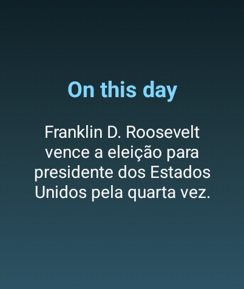

🕰️ On This Day App

On This Day App is a Wear OS application developed for the course Desenvolvimento de Aplicativos para Objetos Portáteis (Development of Applications for Portable Devices), part of the Postgraduate Degree in Mobile Application Development at UTFPR.

📖 Overview

The app displays historical events that occurred on the current day by fetching data from the Wikipedia API.

It provides users with a simple and elegant way to learn about important moments in history directly from their smartwatch.

🌐 API Reference

The application uses the Wikipedia Feed API — specifically the On This Day endpoint:

🔗 https://api.wikimedia.org/wiki/Feed_API/Reference/On_this_day

This API returns notable historical events, births, and deaths for a given day.

⚙️ Features

📅 Displays historical events of the current day

🌍 Retrieves data dynamically from Wikipedia’s API

🕹️ Designed specifically for Wear OS using Jetpack Compose

💡 Simple and user-friendly interface

  

🧑‍💻 Author

Developed by João Pedro as part of the UTFPR postgraduate coursework.